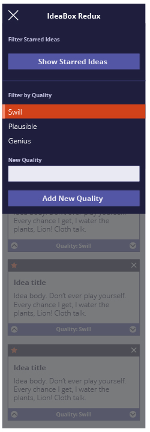

# IdeaBox

Below is the result of the Mod 1 1906 paired project between Allison Wagner and Quinne Farenwald at Turing School of Software and Design. IdeaBox is a web application in which the user can record and archive all ideas, good or bad. The focuses of this project are to provide a fluid and responsive user interface using JavaScript and JSON/localStorage to implement client side data persistence for ideas and other important information on the page.

Allison and Quinne practiced an agile workflow by completing the project in two week long sprints while holding daily stand-ups. As quickly as possible, an MVP was created, and built upon from there until the due date.

## Visuals

**IdeaBox Initial Static Comp Desktop:**

**IdeaBox Initial Static Comp Mobile:**

**IdeaBox Initial Static Comp Mobile With Toggle Menu:**

## Link to GitPages

## Contributions

Allison Wagner and Quinne Farenwald
