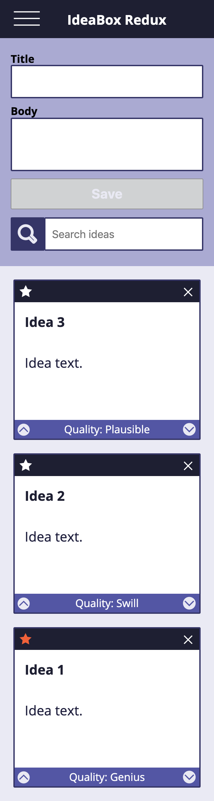

# IdeaBox

Below is the result of the Mod 1 1906 paired project between Allison Wagner and Quinne Farenwald at Turing School of Software and Design. IdeaBox is a web application in which the user can record and archive all ideas, good or bad. Upon opening the application, if the user has yet to store an idea, they are prompted to do so. By entering a title and body for their idea in the form and clicking save, a card will be created in the section below as a card. These cards have the ability to be stared as a favorite, labeled for the overall quality by clicking the upvote and downvote buttons and deleted. A user can have as few or as many ideas as they wish. A search function is available to help narrow down to the desired idea based off the text on the cards.

The focuses of this project are to provide a fluid and responsive user interface using JavaScript and JSON/localStorage to implement client side data persistence for ideas and other important information on the page. The desktop and larger device views have a side bar menu. The mobile view turns the side bar menu to a toggle menu that appears when the hamburger icon is clicked and can be closed by clicking the now X icon. A separate data model is used along with the DOM model. Id's are created and targeted for each card and accessed using a data-* attribute. Arrays are incorporated and iterated over to filter what is being displayed. It is important that along with all functionality, the code is clean and dry.

Allison and Quinne practiced an agile workflow by completing the project in two week-long sprints while holding daily stand-ups. As quickly as possible, an MVP was created, and built upon from there until the due date.

## Visuals

**IdeaBox Initial Static Comp Desktop:**

**IdeaBox Initial Static Comp Mobile:**

**IdeaBox Initial Static Comp Mobile With Toggle Menu:**

**IdeaBox Final Comp Desktop:**

**IdeaBox Final Comp Desktop With Cards:**

**IdeaBox Final Comp Desktop With Save Enabled:**

**IdeaBox Final Comp Desktop With Search:**

**IdeaBox Final Comp Mobile:**

**IdeaBox Final Comp Mobile With Toggle Menu:**

## Link to GitPages
https://allisonjw.github.io/Idea-Box/

## Contributions

Allison Wagner and Quinne Farenwald
